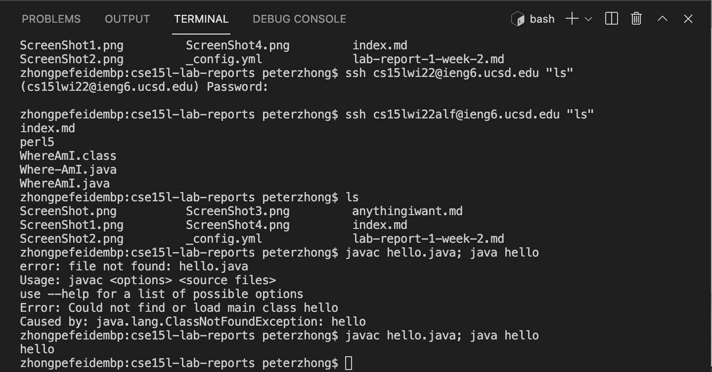

# SSH Tutorial
1. First of all, we need to download VSCode, which is a very helpful environment.

2. 
-We will use console in VSCode to connect to remote server.
-the command is: ssh cs15lwi22???@ieng6.ucsd.edu, where you have to look up ??? on you own account.
-typing your password will get you connected.

3. 
-try some commands, like cd (file name), ls, ls -a. Typing "exit" will disconnect you from the server.

4. 
-we may copy files from your local working computer to remote server by typing:
scp index.md cs15lwi22alf@ieng6.ucsd.edu:~/

5. 
Since typing password each time is annoying, we may set up public and private key and this allows us to skip typing passwork when we are on our own computer.
-first type "ssh-keygen" (you can skip the passphrase if you want)
-next, log in to your remote server and make a file by typing "mkdir. ssh" at your remote server.
-finally, come back to your client and send the public key to your server by typing:
scp (location) cs15lwi22alf@ieng6.ucsd.edu:~/.ssh/authorized_keys, where you need to copy down the location of public key given to you when yo initialized the two keys.
now you can login without typing password.

6. 
-finally, there are some tricks that makes terminal even easier to use.
-you may type command:
ssh cs15lwi22@ieng6.ucsd.edu "ls" (or some other commands), this allows you to connect, run the command, then log you out right after, which enables a quick glance on the server without staying connecting.
-"javac hello.java; java hello"
In this example, ";" behaves just like enter, it will run the several commands separately.
