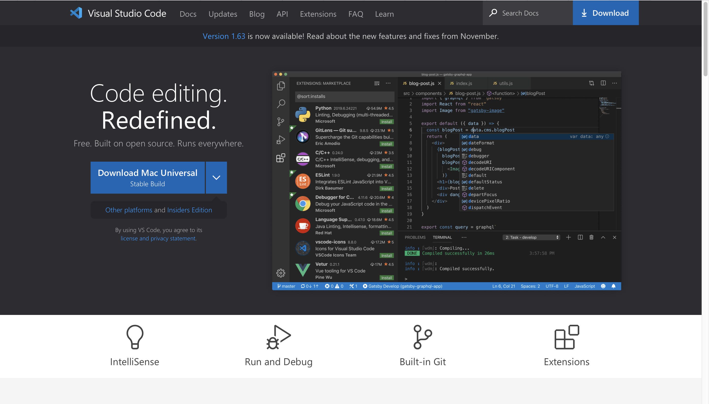
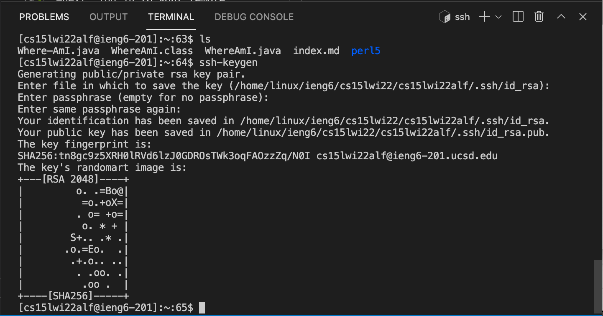

# SSH Tutorial
## 1. Set up environment
First of all, we need to download VSCode, which is a very helpful environment.   
This is the link to download VSCode:
[VSCode](https://code.visualstudio.com)

## 2. Connect to remote server
-We will use console in VSCode to connect to remote server.  
-the command is: `ssh cs15lwi22???@ieng6.ucsd.edu`, where you have to look up ??? on you own account.   
This is the link to lookup account:
[UCSD Account](https://sdacs.ucsd.edu/~icc/index.php)   
-typing your password will get you connected.

## 3. Try commands on remote server
-Try some commands, like `cd (working directory name)`, `ls`, `ls -a`. Typing `exit` will disconnect you from the server.

## 4. Sent files from client to remote server
-We may copy files from your local working computer to remote server by typing: `scp index.md cs15lwi22alf@ieng6.ucsd.edu:~/`

## 5. How to skip typing password?
Since typing password each time is annoying, we may set up public and private key and this allows us to skip typing password when we are on our own computer.  
-first type `ssh-keygen` (you can skip the passphrase if you want)  
-next, log in to your remote server and make a file by typing `mkdir. ssh` at your remote server.  
-finally, come back to your client and send the public key to your server by typing: `scp (location) cs15lwi22alf@ieng6.ucsd.edu:~/.ssh/authorized_keys`
where you need to copy down the location of public key given to you when you initialized the two keys. Now you can login without typing password.

## 6. Useful tricks/how to save move running remotely
-Finally, there are some tricks that make terminal even easier to use.  
-you may type command: `ssh cs15lwi22@ieng6.ucsd.edu "ls"` (or some other commands), this allows you to connect, run the command, then log you out right after, which enables a quick glance on the server without staying connecting.  
-`javac hello.java; java hello`
In this example, `;` behaves just like enter, it will run the several commands separately.

-If we make a change on our file, and copy the updated file to reomote server and run it, we will only need to run the commands `scp WhereAmI.java cs15lwi22alf@ieng6.ucsd.edu:~/` as well as `ssh cs15lwi22alf@ieng6.ucsd.edu "javac WhereAmI.java; java WhereAmI"`, which takes up 3 keystrokes. This will make running files on remote server much easiler.