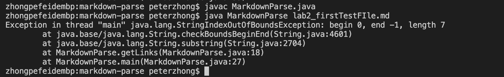

# Fixing Bugs on MarkdownParse.java
## 1. First Bug
-Screenshot of code change diff:

-Link to the test file that is causing failures:
[FirstTestFile](https://github.com/pz2105/markdown-parse/blob/main/lab2_firstTestFIle.md)   
-Output in terminal:

## 2. Second Bug
-Screenshot of code change diff:

-Link to the test file that is causing failures:
[SecondTestFile](https://github.com/HangLiu01/markdown-parse/blob/d8ba9c8b881027c95b046f356b764ca977003608/new-file.md)  
-Output in terminal:

## 3. Thrid Bug
-Screenshot of code change diff:

-Link to the test file that is causing failures:
[ThirdTestFile](https://github.com/pz2105/markdown-parse/blob/main/lab2_thirdTestFile.md))  
-Output in terminal:
