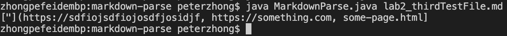

# Fixing Bugs on MarkdownParse.java
## 1. First Bug
-Screenshot of code change diff:

-Link to the test file that is causing failures:
[FirstTestFile](https://github.com/pz2105/markdown-parse/blob/main/lab2_firstTestFIle.md)   
-Output in terminal:

-The bug here is that when searching `(`, there isn't any in the testing file, so program return -1, which causes further question. THe symptom directly tells us that -1 is used when fetching substring. Thus, it is quit easy to locate the bug and make some changes.

## 2. Second Bug
-Screenshot of code change diff:

-Link to the test file that is causing failures:
[SecondTestFile](https://github.com/HangLiu01/markdown-parse/blob/d8ba9c8b881027c95b046f356b764ca977003608/new-file.md)  
-Output in terminal:

-The bug is that if there is image embeded in testing file, the style is very similar to a link, so the program will interpret it as a link, which we don't want. The sypmtom is that program prints out the name of the image embeded. This bug is also easy to find, and we just need to check the `!` before considering a link.
## 3. Thrid Bug
-Screenshot of code change diff:

-Link to the test file that is causing failures:
[ThirdTestFile](https://github.com/pz2105/markdown-parse/blob/main/lab2_thirdTestFile.md))  
-Output in terminal:

-This bug is more complicated. We are considering the possibility that description of the link contains `(` as well as `[`. This without doubt causes bugs to the program because it cannot accurately distinguish the correct starting point of actual link. The symptom prints out part of the description as if it is part of the link. So we need to check whether there is `(` directly following `]` to ensure that this is the starting point of link (there may be other extreme cases, but we need to draw the line somewhere).