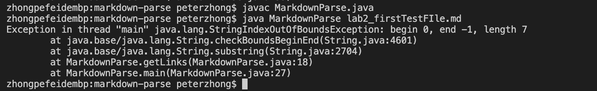
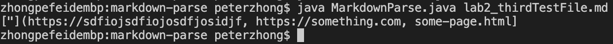

# Copy Whole Directories with `scp -r`
## 1. Copying The Whole Directories to Server
-First of all, we should open up the terminal and go into the directory where we wish to copy everything to the server.     
-Then, we should run the command    
`scp -r . cs15lwi22@ieng6.ucsd.edu:~/markdown-parse`    
where `-r` tells the computer to work recursively, and `.` means the source is the current directory.   
-Followed by our server's address: `cs15lwi22@ieng6.ucsd.edu`.      
-Finally, we want to create a new directory in the server called `markdown-parse` and send all files into it. We could select other names for the file we want.     
-Output in terminal:
    
-If we only want to send java files, markdown files, or some specific subdirectories to the server, we may use the following code:  
`scp -r *.java *.md lib/ cs15lwi22@ieng6.ucsd.edu:markdown-parse`
where `*.java` means send every file ending with `.java`, and `lib/` refers to the directory we want to send.

## 2. Logging into Remote Server and Run the Test
-Now, we want to login to the server and check whether our attempt was successful, and try to run JUnit tests.      
-Since we have previously set up the passphrase keys, we may login with only one command without typing password:
`ssh cs15lwi22alf@ieng6.ucsd.edu`           
-We can see that a new directory named "markdown-parse" is created, and all files were copied to this location.     
-We will compile and run the JUnit tests we tried in previous lab using the command provided:
`javac -cp .:lib/junit-4.13.2.jar:lib/hamcrest-core-1.3.jar MarkdownParseTest.java`         
`java -cp .:lib/junit-4.13.2.jar:lib/hamcrest-core-1.3.jar org.junit.runner.JUnitCore MarkdownParseTest`        
-For some reason, compling the testing file might give an error, we just need to recompile `MarkdownParse.java` before we compile tester.       
-We can see that JUnit test ran successfully, and so we've accomplished our task!       
-Output in terminal:

## 3. Complete Everything In One Line
-In order to do everything we've shown in this page in one line of command, we may find first week's lab useful, where `;` on command line acts as a new line (i.e. run the preceeding and succeeding command separately), as well as `ssh ...ieng6... "ls"` to login to remove server, run the commands between quotation marks, and exit.     
-Output in terminal:

