# Additional MarkdownTest Snippets
[My MarkdownParse Repo](https://github.com/pz2105/myMarkdownParse.git)   
[Reviewed MarkdownPrase Repo](https://github.com/ucsd-cse15l-w22/markdown-parse.git)
## First Snippet
-Using CommonMark, the expected output would be `"%60google.com", "google.com", "ucsd.edu"`.
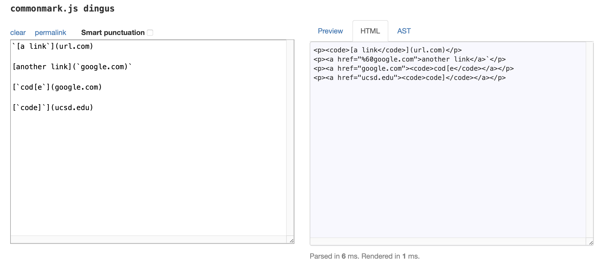    

-Test Code
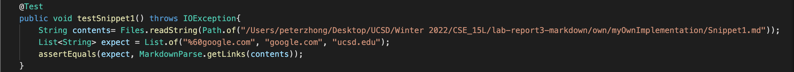

-The test using my own implementation did not pass, and the corresponding output is `"url.com", "google.com", "google.com", "ucsd.edu"`.
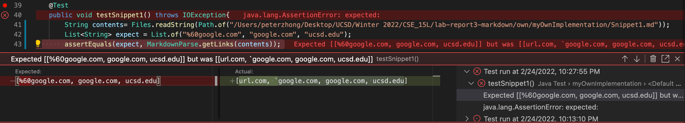

-The test using reviewed implementation did not pass, and the corresponding output is `"url.com", "google.com", "google.com"`.
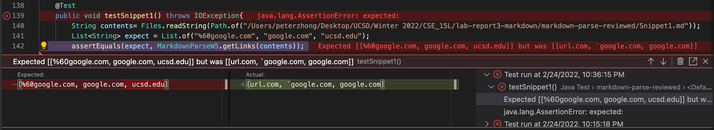

-For this bug, we should be able modify it and make it work for back ticks by simply checking whether there is backticks contained in link or in the description of link. However, when we are generating the expected output using CommonMark, the backtick was converted to `%60` in HTML. If that is really what we want, we may just replace backtick with `%60` when printing output.

## Second Snippet
-Using CommonMark, the expected output would be `"a.com", "a.com(())", "example.com"`
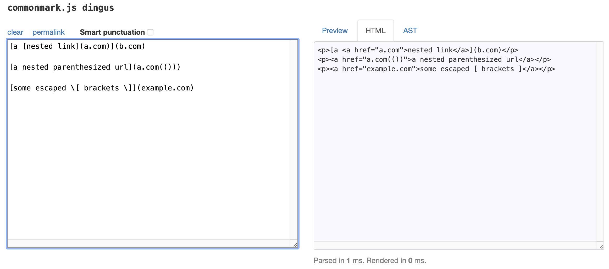    

-Test Code
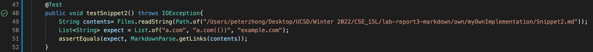

-The test using my own implementation did not pass, and the corresponding output is `"a.com", "a.com(())", "example.com"`.
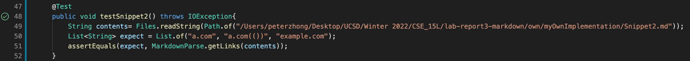

-The test using reviewed implementation did not pass, and the corresponding output is `"a.com", "a.com(("`.
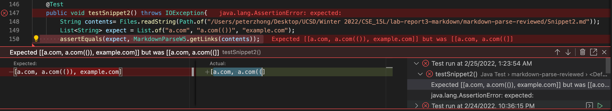

-The test of my own implementation already works well for this case of situation

## Third Snippet
-Using CommonMark, the expected output would be `"https://ucsd-cse15l-w22.github.io/"`.
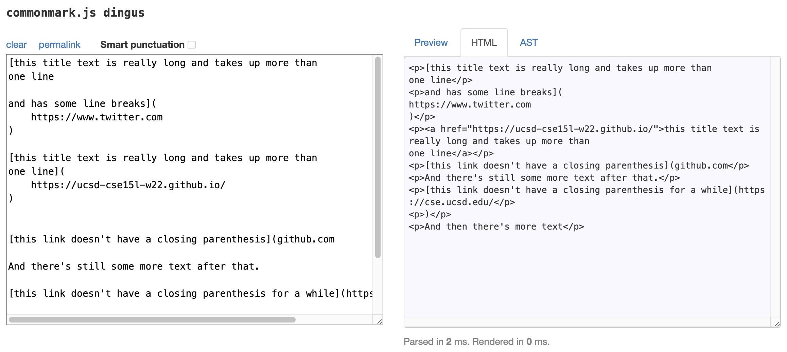    

-Test Code
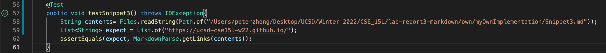

-The test using my own implementation did not pass, and the corresponding output is `StringIndexOutOfBoundsException`.
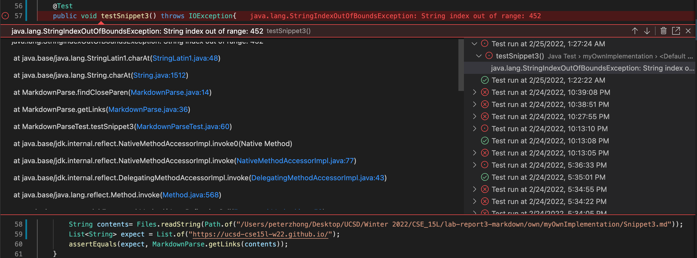

-The test using reviewed implementation did not pass, and the corresponding output is `"https://www.twitter.com", "https://ucsd-cse15l-w22.github.io/", "github.com And there's still some more text after that. [this link doesn't have a closing parenthesis for a while](https://cse.ucsd.edu/"`.
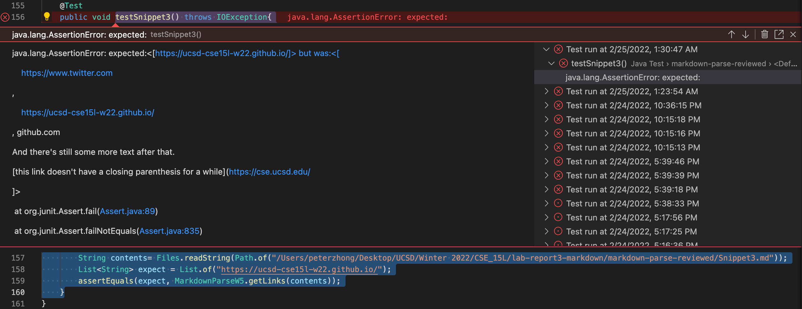

-For this bug, the problem is there is no closing prarenthesis after link `github.com`. It is easy to resolve this by checking whether `indexOf` returns `-1`. But it is quite difficult ask the program to produce the expected output because we will have to check line break, missing bracket, and space. It is impossible to take  all possibilities into account. So, in practice, we will have to draw the line somewhere.