# Comparison of Two Implementation on Two Chosen Test Files
[My MarkdownParse Repo](https://github.com/pz2105/myMarkdownParse.git)   
[Reviewed MarkdownPrase Repo](https://github.com/ucsd-cse15l-w22/markdown-parse.git)
## How I Found The Tests
-First I added a line to the bash scipt so that before printing out each result from the `test-files`, it would gives the name of the test file we are running our program on
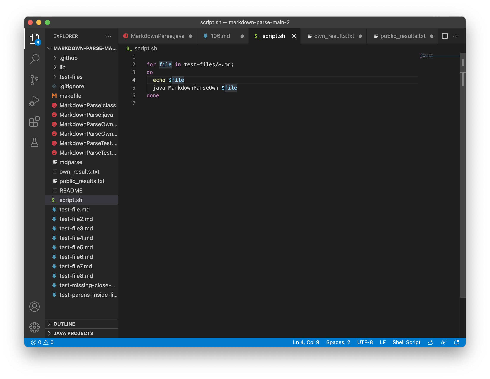     
-Then, I ran the test folder on provided java file and export the result to `public-results.txt`.
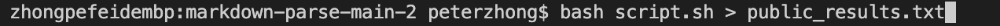     
-Next, I imported the `MarkdownParse.java` file our group was working on and perform the same thing above, exporting the result to `own-results.txt`.
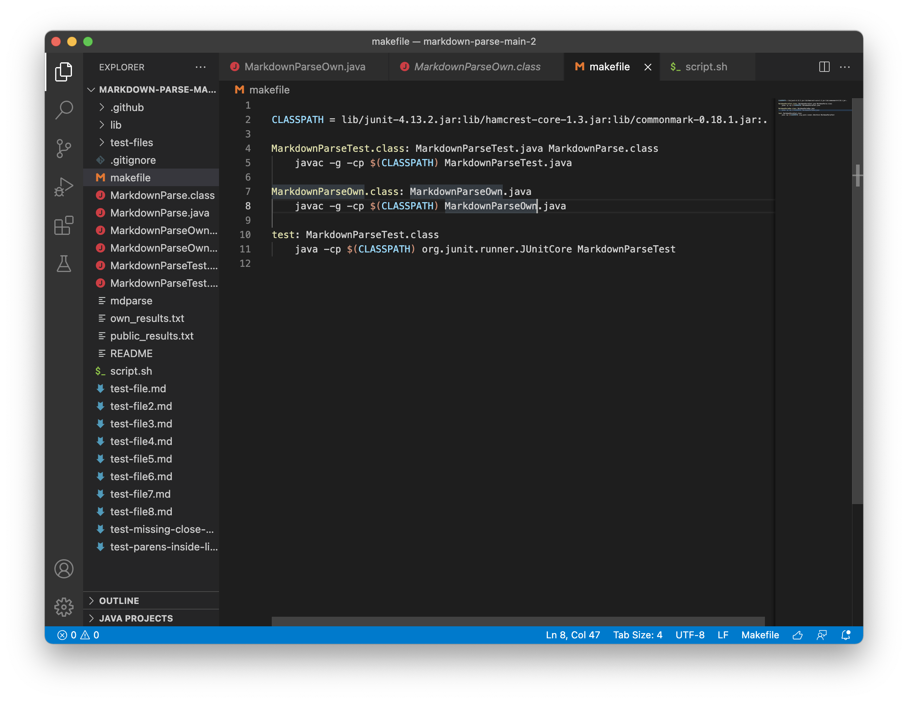     
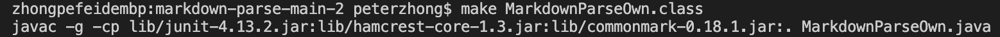     
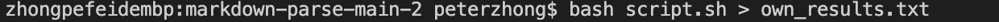     
In order the compare the two files, I used the command `diff` followed by the two files I just created. Searching within the output, I am able to locate the file the program was running on since I added the file name up front (order of accessing the file within folder does not following numerical order).
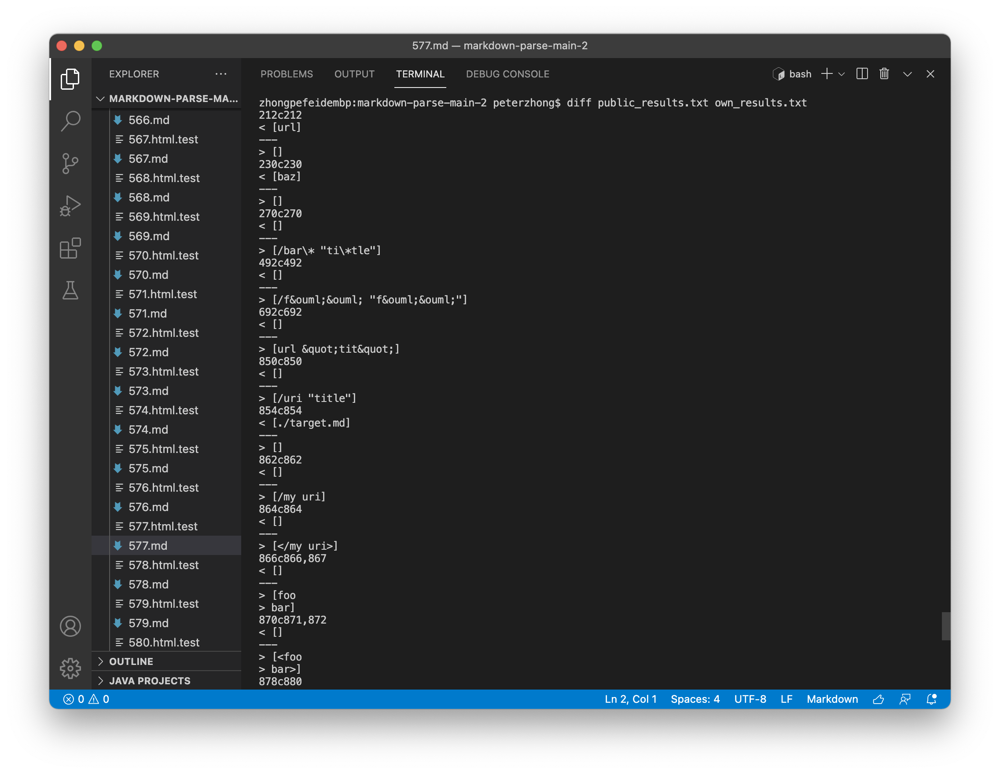     

## First Test
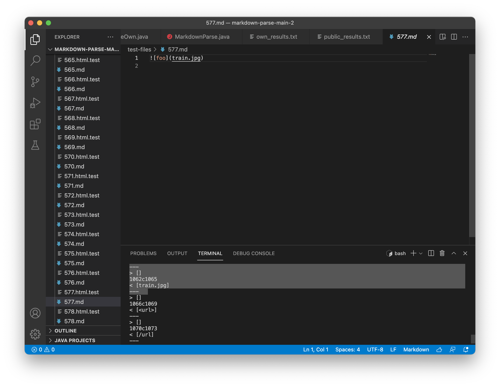  
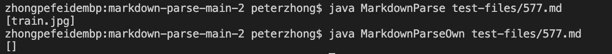  
-For file `577.md`, the output with our own implementation is `[]`, while that for provided implementation is `[train.jpg]`.  
-Since this is an image, the actual result should be `[]`. Thus, the implementation provided is incorrect.
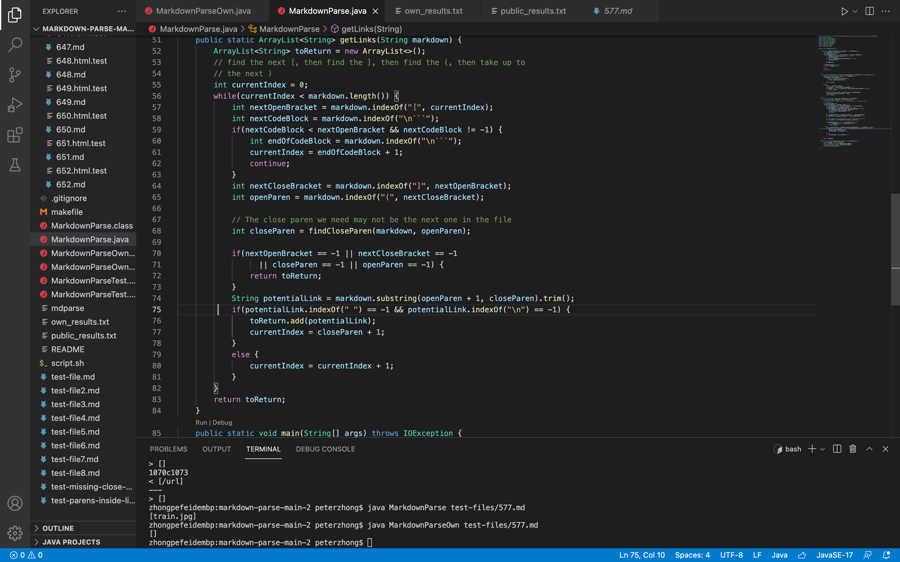  
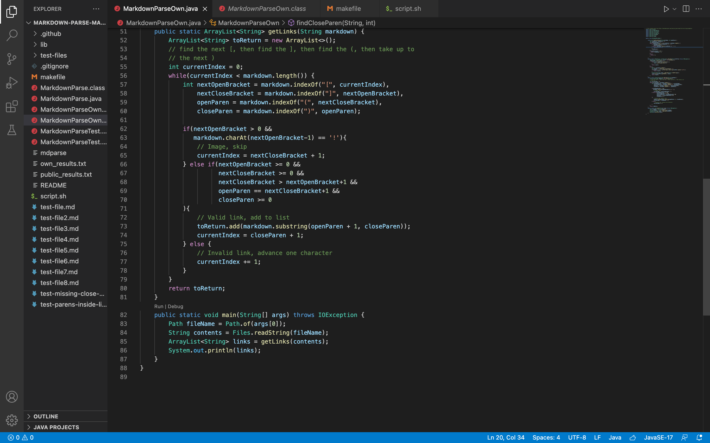  
-As we can see, the provided java file did not take image into account, which is indicated by `!` that comes before `[`. In order to make this implementation behave correctly, we should add an if statement on each `[` to identify a potential image.

## Second Test
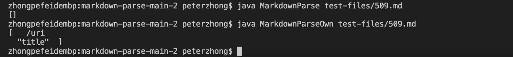  
-For file `509.md`, the output with our own implementation is `[    /uri \n "title"]`, while that for provided implementation is `[]`. Since no link should contain space or `\n`, the actual output should be `[]`.
  
  
-The implementation provided takes into account that if there is space or `\n` envolved inside within a potential link, it should not be considered a valid link. However, within the our own implementation, the program simply search for next close `]`, without taking care of space or `\n`, which is incorrect. Thus, in order to fix it, we ought to check `\n` as well as space just like the provided implementation.