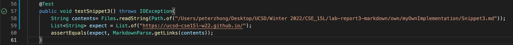
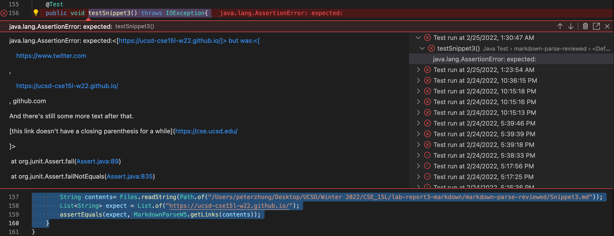

# Comparison of Two Implementation on Two Chosen Test Files
[My MarkdownParse Repo](https://github.com/pz2105/myMarkdownParse.git)   
[Reviewed MarkdownPrase Repo](https://github.com/ucsd-cse15l-w22/markdown-parse.git)
## How I Found The Tests
-First I added a line to the bash scipt so that before printing out each result from the `test-files`, it would gives the name of the test file we are running our program on
     
-Then, I ran the test folder on provided java file and export the result to `public-results.txt`.
     
-Next, I imported the `MarkdownParse.java` file our group was working on and perform the same thing above, exporting the result to `own-results.txt`.
     
     
     
In order the compare the two files, I used the command `diff` followed by the two files I just created. Searching within the output, I am able to locate the file the program was running on since I added the file name up front (order of accessing the file within folder does not following numerical order).
     

## First Test

## Second Test
-Using CommonMark, the expected output would be `"https://ucsd-cse15l-w22.github.io/"`.
    

-Test Code

-The test using my own implementation did not pass, and the corresponding output is `StringIndexOutOfBoundsException`.

-The test using reviewed implementation did not pass, and the corresponding output is `"https://www.twitter.com", "https://ucsd-cse15l-w22.github.io/", "github.com And there's still some more text after that. [this link doesn't have a closing parenthesis for a while](https://cse.ucsd.edu/"`.

-For this bug, the problem is there is no closing prarenthesis after link `github.com`. It is easy to resolve this by checking whether `indexOf` returns `-1`. But it is quite difficult ask the program to produce the expected output because we will have to check line break, missing bracket, and space. It is impossible to take  all possibilities into account. So, in practice, we will have to draw the line somewhere.